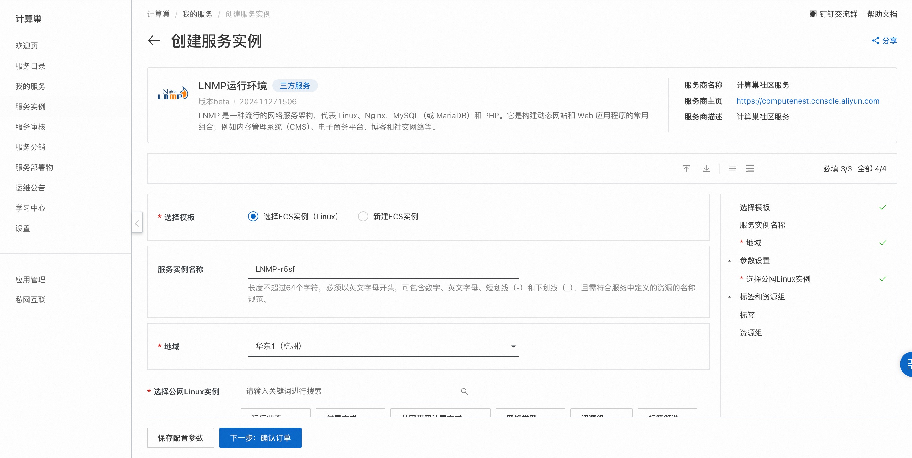
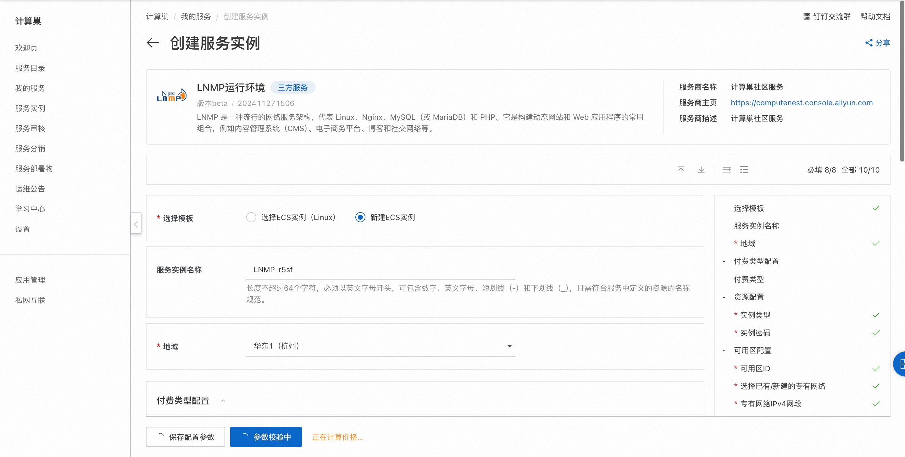
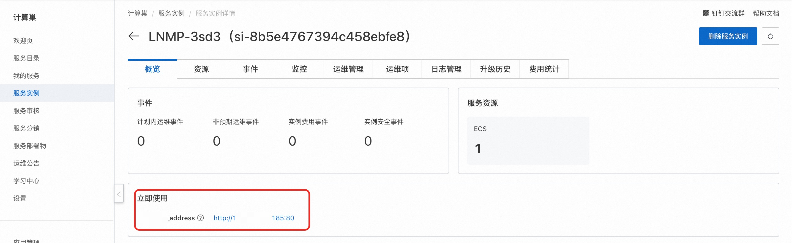
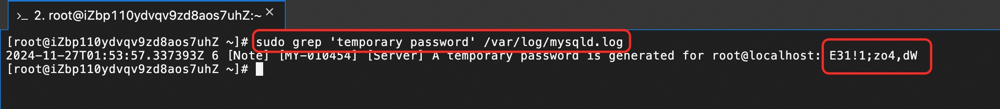

<h1> Quickly deploy the LNMP runtime environment </h1>

<h2> Overview </h2>

LNMP is a popular web services architecture that stands for Linux, Nginx, MySQL (or MariaDB), and PHP. It is a common combination for building dynamic websites and web applications, such as content management systems (CMS), e-commerce platforms, blogs, and social networks. 

 This service supports deployment on existing ECS instances (Linux) and deployment on new ECS instances (Linux). 

<h2> Billing instructions </h2>

 The cost of deploying the LNMP operating environment on the computing nest mainly involves:

<ul>
<li> Selected vCPU and Memory Specifications </li>
<li> Disk capacity </li>
<li> Internet bandwidth </li>
</ul>

 Billing method: Pay-As-You-Go (hourly)

 The estimated cost is visible in real time when the instance is created. 

<h2> Permissions required for RAM accounts </h2>

 To deploy an LNMP runtime environment, you need to access and create resources such as ECS and VPC. If you use a RAM user to create a service instance, you need to add the corresponding resource permissions to the account of the RAM user before creating the service instance. For more information about how to add RAM permissions, see <a href = "https://help.aliyun.com/document_detail/121945.html"> Authorize RAM users </a>.
. The required permissions are shown in the following table. 

<table>
<thead>
<tr>
<th> Permission policy name </th>
<th> Remarks </th>
</tr>
</thead>
<tbody>
<tr>
<td>AliyunECSFullAccess</td>
<td> Permissions to manage ECS </td>
</tr>
<tr>
<td>AliyunVPCFullAccess</td>
<td> Permissions for managing VPC networks </td>
</tr>
<tr>
<td>AliyunROSFullAccess</td>
<td> Manage permissions for Resource Orchestration Services (ROS) </td>
</tr>
<tr>
<td>AliyunComputeNestUserFullAccess</td>
<td> Manage user-side permissions for the compute nest service (ComputeNest) </td>
</tr>
<tr>
<td>AliyunCloudMonitorFullAccess</td>
<td> Permissions to manage CloudMonitor (CloudMonitor) </td>
</tr>
</tbody>
</table>

<h2> Select ECS instance deployment </h2>

 Select ECS instance deployment to support Linux OS. 

<h3> Prerequisites </h3>

<ol>
<li> The selected ECS instance can access the Internet </li>
<li> The selected ECS instance is running. If the instance has just started, wait a moment. </li>
<li> System compatibility: Alibaba Cloud Linux 3.2104 LTS/CentOS 7.7/CentOS 7.8/CentOS 7.9/Ubuntu 20.04/Ubuntu 22.04</li>
</ol>

<h3> Operation steps </h3>

<ol>
<li> Click <a href = "https://computenest.console.aliyun.com/service/instance/create/default?type=user&ServiceName=LNMP%E8%BF%90%E8%A1%8C%E7%8E%AF%E5%A2%83"> Deployment Link </a> to go to the Service Instance Deployment page. </li>
<li> Select the target ECS instance and click Next: Confirm Order.
</li>
<li> Click Create Now and wait for the service instance to be created. After the service instance is created, go to the service instance details page. Visit the ECS public network to view the environment deployment results.
</li>
</ol>

<h2> Create ECS instance deployment </h2>

 The new ECS instance supports the Linux operating system. 

<h3> Operation steps </h3>

<ol>
<li> Click <a href = "https://computenest.console.aliyun.com/service/instance/create/default?type=user&ServiceName=LNMP%E8%BF%90%E8%A1%8C%E7%8E%AF%E5%A2%83"> Deployment Link </a> to go to the Service Instance Deployment page. </li>
<li> Select the new ECS instance and configure the parameters according to the interface prompts. After the configuration is complete, click Next: Confirm Order.
</li>
<li> Click Create Now and wait for the service instance to be created. After the service instance is created, go to the service instance overview page.
</li>
<li> Access the service address to view the environment deployment results.
</li>
</ol>

<h2> Change the mysql password </h2>

<ol>
<li>
 Obtain the initial root password, connect to ECS and run the following command:

<pre><code>sudo grep 'temporary password' /var/log/mysqld.log
</code></pre>

</li>
<li>
 Use the initial password to connect to mysql:

<pre><code>mysql -u root -p
</code></pre>

</li>
<li>
 Change password 

<pre><code>ALTER USER 'root'@'localhost' IDENTIFIED BY 'YourNewPassword! ';
</code></pre>

</li>
</ol>
